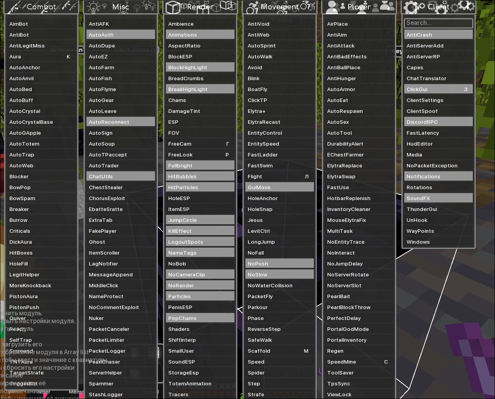
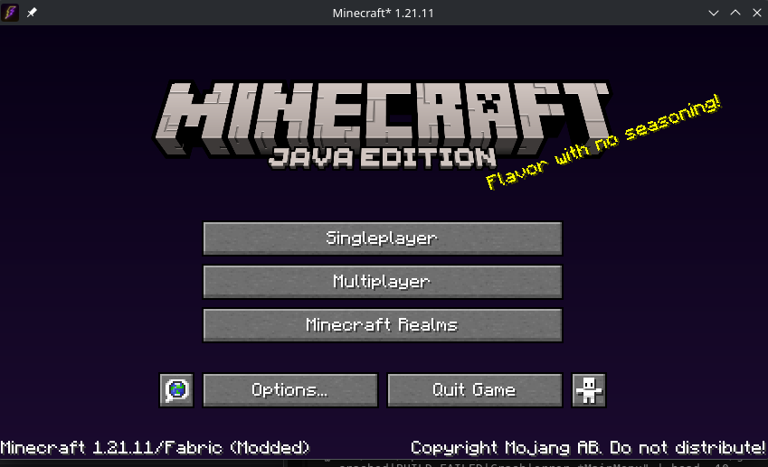

> [!IMPORTANT]
> **RU: Этот проект устарел и больше не поддерживается. Пожалуйста, переходите на [RaveX](https://ravex.serveousercontent.com/) ([GitHub](https://github.com/StormDevzz/RaveX)) - новый клиент от StormDevzz, который намного стабильнее, оптимизированнее и не такой поломанный!**
>
> **EN: This project is outdated and no longer maintained. Please switch to [RaveX](https://ravex.serveousercontent.com/) ([GitHub](https://github.com/StormDevzz/RaveX)) - a new client by StormDevzz that is much more stable, optimized, and less broken!**

    

# ThunderHack Reborn

**Неофициальное продолжение ThunderHack Reborn от организации StormDevzz**
 
**Unofficial continuation of ThunderHack Reborn by StormDevzz**

> **ThunderHack Reborn** -- форк оригинального ThunderHack Recode, разрабатываемый организацией StormDevzz.
> Оригинальный проект был остановлен 09.10.2024. Мы продолжаем его развитие,
> добавляя новые модули, исправляя баги и поддерживая актуальные версии Minecraft.
>
> **Мы не аффилированы с оригинальными разработчиками ThunderHack.**
> **Также советуем глянуть [RaveX](https://ravex.serveousercontent.com/) - наш новый клиент!**

> **ThunderHack Reborn** is a fork of the original ThunderHack Recode, maintained by StormDevzz.
> The original project was discontinued on 09.10.2024. We carry on its legacy
> by adding new modules, fixing bugs, and keeping up with modern Minecraft versions.
>
> **We are not affiliated with the original ThunderHack developers.**
> **Also check out [RaveX](https://ravex.serveousercontent.com/) - our new client!**

---

---

## Информация / Information

**RU:**
- **Версия Minecraft:** `Fabric` 1.21.11
- **Кнопка открытия ClickGui:** `P`
- **Префикс команд:** `@`
- **Средняя кнопка мыши** по модулю назначает бинд

**EN:**
- **Minecraft version:** `Fabric` 1.21.11
- **Default ClickGui keybind:** `P`
- **Default prefix:** `@`
- **Middle click** a module to bind it

> **RU:** Советуем [RaveX](https://ravex.serveousercontent.com/) - более новый клиент от StormDevzz!
>
> **EN:** Check out [RaveX](https://ravex.serveousercontent.com/) - a newer client by StormDevzz!
>
> ---
>
> **RU:** Осторожно: Expensive, DoxWare 2.0, gumballoff, Treoderia "Recode", Deluxe Client и Quick Client являются скидами/ратами этого клиента.
>
> **EN:** Warning: Expensive, DoxWare 2.0, gumballoff, Treoderia "Recode", Deluxe Client, and Quick Client are both skids and rats based on this client

---

## Зависимости / Dependencies

**RU:**
- **Minecraft:** 1.21.11 (Fabric)
- **Fabric Loader:** >= 0.16.10
- **Fabric API:** 0.141.4+1.21.11

- **Orbit (MeteorDevelopment):** 0.2.3 -- EventBus
- **Netty:** 4.1.90.Final (netty-handler-proxy, netty-codec-socks) -- прокси для соксов
- **Baritone (опционально):** 1.21.11-SNAPSHOT -- путь-поиск для AutoMine/AutoWalk

**EN:**
- **Minecraft:** 1.21.11 (Fabric)
- **Fabric Loader:** >= 0.16.10
- **Fabric API:** 0.141.4+1.21.11

- **Orbit (MeteorDevelopment):** 0.2.3 -- EventBus
- **Netty:** 4.1.90.Final (netty-handler-proxy, netty-codec-socks) -- SOCKS proxy support
- **Baritone (optional):** 1.21.11-SNAPSHOT -- pathfinding for AutoMine/AutoWalk

---

## Требования / Requirements

- [Fabric API 1.21](https://www.curseforge.com/minecraft/mc-mods/fabric-api/files/5531908)
- [Java 21+](https://www.oracle.com/java/technologies/javase/jdk21-archive-downloads.html)

---

## Рекомендуем к прочтению / Recommended Reading

- [Performance guide for Minecraft 1.20.4+ Clients](https://gist.github.com/HexedHero/aab340a84db51913cb1106c2d85f4e4f)
- [Setup guide by @DevilishRak](https://thunderguidemc.vercel.app/)
- [RaveX](https://ravex.serveousercontent.com/) - новый клиент от StormDevzz / new client by StormDevzz

---

## Благодарности / Credits

**RU: Оригинальные разработчики ThunderHack:**
- StormDevzz -- создатель ThunderHack Reborn
- Все контрибьюторы оригинального проекта

**EN: Original ThunderHack developers:**
- StormDevzz -- creator of ThunderHack Reborn
- All contributors to the original project

**Библиотеки и фреймворки / Libraries and frameworks:**
- [@meteordevelopment](https://github.com/meteordevelopment) за Orbit / for Orbit
- [@ladysnake](https://github.com/ladysnake) за Satin / for Satin
- [@0x3C50](https://github.com/0x3C50/Renderer) за рендерер / for the renderer

**Контрибьюторы ThunderHack Reborn / ThunderHack Reborn contributors:**
- [StormDevzz](https://github.com/stormdevzz) -- организация-разработчик / maintaining organization
- VFedTerV и другие участники / and other contributors

**Медиа / Media:**
- [Ai_24](https://www.youtube.com/@Ai_24) за обзоры / for showcases
- [KiLAB Gaming](https://www.youtube.com/@KiLABGaming) за полный обзор / for the full overview

---

## Скриншоты / Screenshots

GUI

CRYSTAL HVH

SWORD HVH

---

## Новые Скриншоты / New Screenshots

NEW GUI

1.21.11 FINALLY

---

## Аддоны / Addons

### Ресурсы для разработчиков / Developer Resources

- [Addon Template](https://github.com/cvs0/ThunderHack-Recode-Addon-Template) от / by cvs0
- ThunderHack Addon Docs (скоро / coming soon)

---

## Дисклеймер / Disclaimer

**RU:** Этот форк является неофициальным продолжением и не связан с оригинальными разработчиками ThunderHack. Мы не несём ответственности за использование данного программного обеспечения. Используйте только на серверах, где это разрешено.
**Советуем [RaveX](https://ravex.serveousercontent.com/) - наш новый клиент.**

**EN:** This fork is an unofficial continuation and is not affiliated with the original ThunderHack developers. We are not responsible for the use of this software. Use only on servers where it is allowed.
**Check out [RaveX](https://ravex.serveousercontent.com/) - our new client.**

---

**[StormDevzz](https://github.com/stormdevzz) -- организация, продолжающая легенду**
 
**[StormDevzz](https://github.com/stormdevzz) -- the organization carrying on the legacy**

**Попробуйте [RaveX](https://ravex.serveousercontent.com/) - наш новый клиент!**
 
**Try [RaveX](https://ravex.serveousercontent.com/) - our new client!**