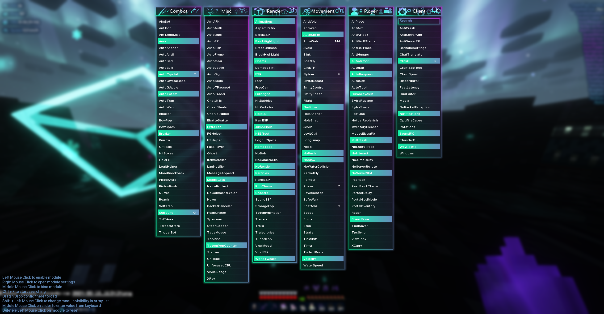
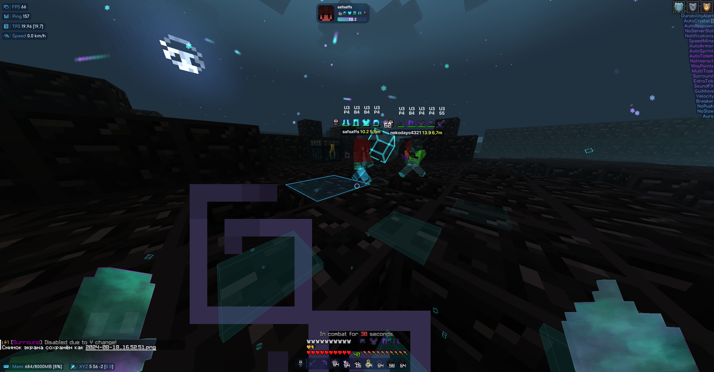
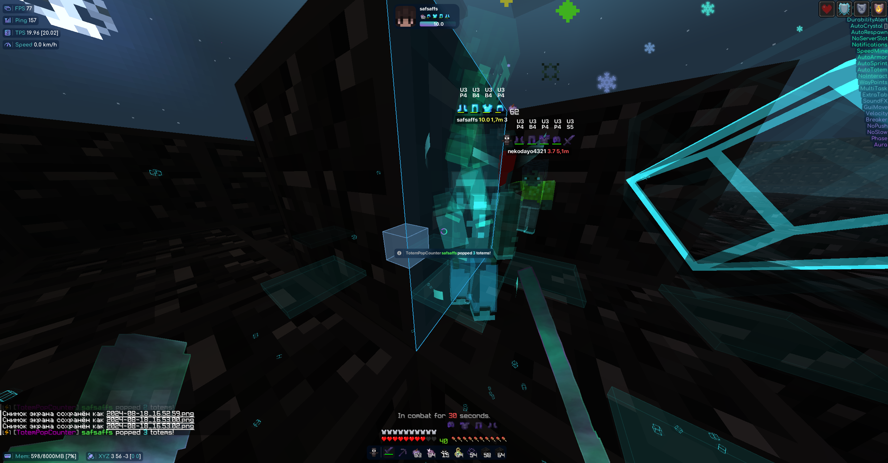
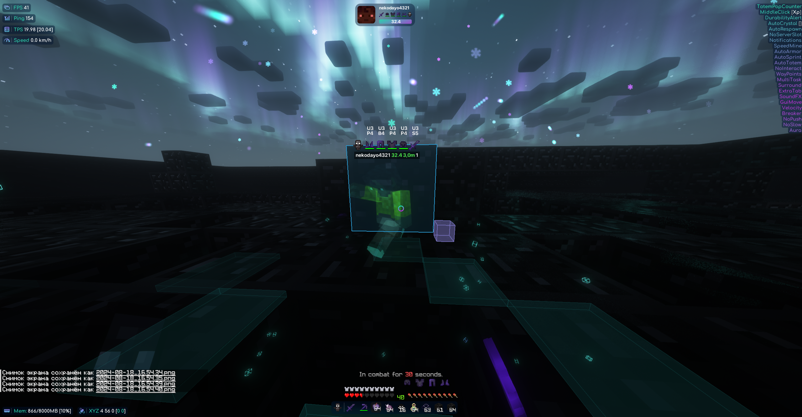

    

# ThunderHack Reborn

**Неофициальное продолжение легендарного ThunderHack Recode**

---

> **ThunderHack Reborn** — это форк оригинального ThunderHack Recode, разрабатываемый сообществом.
> Оригинальный проект был остановлен 09.10.2024, но мы продолжаем его развитие,
> добавляя новые модули, исправляя баги и поддерживая актуальные версии Minecraft.
>
> **Мы не аффилированы с оригинальными разработчиками ThunderHack.**

---

---

##  Information

- **Minecraft version:** `Fabric` 1.21 / 1.21.1
- **Default ClickGui keybind:** `P` (или уточняйте в Discord сервере)
- **Default prefix:** `@`
- **Middle click** модуль для назначения бинда

>  **Осторожно:** Expensive, DoxWare 2.0, gumballoff, Treoderia "Recode", Deluxe Client, и Quick Client являются рерайтами/ратами этого клиента.

---

##  Требования

- [Fabric API 1.21](https://www.curseforge.com/minecraft/mc-mods/fabric-api/files/5531908)
- [Java 21+](https://www.oracle.com/java/technologies/javase/jdk21-archive-downloads.html)

---

##  Рекомендуем к прочтению

- [Performance guide for Minecraft 1.20.4+ Clients](https://gist.github.com/HexedHero/aab340a84db51913cb1106c2d85f4e4f)
- [Setup guide by @DevilishRak](https://thunderguidemc.vercel.app/)

---

##  Что нового в ThunderHack Reborn?

- **Новые модули:** AutoDupe, улучшенный Parkour, AntiWeb, Spider с множеством режимов
- **Исправления:** Обновление маппингов до 1.21, фикс совместимости с новым Fabric API
- **Улучшенные режимы:** WaterSpeed Custom, Strafe с множителем скорости, Spider Custom с 10 настройками
- **Активная поддержка:** Постоянные обновления и исправления от сообщества

---

##  Благодарности

**Оригинальные разработчики ThunderHack:**
- Pan4ur — создатель оригинального ThunderHack Recode
- Все контрибьюторы оригинального проекта

**Библиотеки и фреймворки:**
- [@meteordevelopment](https://github.com/meteordevelopment) за Orbit
- [@ladysnake](https://github.com/ladysnake) за Satin
- [@0x3C50](https://github.com/0x3C50/Renderer) за рендерер

**Контрибьюторы ThunderHack Reborn:**
- VFedTerV и другие участники сообщества

**Медиа:**
- [Ai_24](https://www.youtube.com/@Ai_24) за крутые обзоры
- [KiLAB Gaming](https://www.youtube.com/@KiLABGaming) за полный обзор

---

##  Скриншоты

GUI

CRYSTAL HVH

SWORD HVH

---

## 🧩 Аддоны

### Ресурсы для разработчиков

- [Addon Template](https://github.com/cvs0/ThunderHack-Recode-Addon-Template) от cvs0
- [ThunderHack Addon Docs (COMING SOON)]()

---

## ⚖️ Дисклеймер

Этот форк является неофициальным продолжением и не связан с оригинальными разработчиками ThunderHack. Мы не несём ответственности за использование данного программного обеспечения. Используйте только на серверах, где это разрешено.

---

**ThunderHack Reborn** — сообщество, продолжающее легенду

